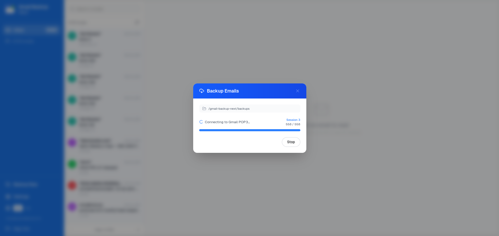

# Gmail Backup Next

<p align="center">
  
</p>

<p align="center">
  <strong>Secure Gmail backup via POP3 · Copia de seguridad de Gmail por POP3</strong>
</p>



---

## English

### What is Gmail Backup Next?

**Gmail Backup Next** is a self-hosted web application that connects to your Gmail account via POP3 and downloads your emails, storing them locally in **EML format** with the following structure:

```
backupFolder/
  you@gmail.com/
    2024/
      04/
        15/
          <message-id>.eml
    index.json
```

- **No duplicates** – uses POP3 UIDL identifiers to skip already-downloaded messages.
- **EML format** – standard RFC 2822 format, compatible with any email client.
- **Gmail-like UI** – navigate, search, and read your backed-up emails in the browser.
- **Bilingual** – English and Spanish interface.
- **Streaming backup progress** – real-time progress via Server-Sent Events.

### Requirements

- Node.js 20+
- Gmail account with **POP access enabled** and a **Google App Password**

### Setup

#### 1. Enable POP in Gmail

1. Gmail → **Settings** → **See all settings** → **Forwarding and POP/IMAP**
2. Select **Enable POP for all mail**
3. Save changes

#### 2. Create a Google App Password

1. Go to [myaccount.google.com/apppasswords](https://myaccount.google.com/apppasswords)
2. Create an app password for "Mail" / "Other"
3. Copy the generated 16-character password

#### 3. Configure the application

```bash
cp .env.local.example .env.local
# Edit .env.local and set a strong secret (32+ chars):
# SECRET_COOKIE_PASSWORD=<your-secret>
#
# Generate one with:
node -e "console.log(require('crypto').randomBytes(32).toString('hex'))"
```

#### 4. Install and run

```bash
npm install
npm run dev
```

Open [http://localhost:3000](http://localhost:3000).

### Usage

1. **Sign in** with your Gmail address and App Password.
2. Go to **Settings** and configure the backup folder (default: `./backups`).
3. Click **Backup Now** to download your emails.
4. Browse, search, and read emails in the Gmail-like interface.
5. **Download** any email as `.eml`.

### Project structure

```
app/
  api/auth/         # login · logout · session
  api/backup/       # SSE streaming backup
  api/emails/       # list · read · download
  api/settings/     # app settings
  dashboard/        # Main UI page
  page.tsx          # Login page
components/         # React UI components
context/            # i18n context
lib/                # POP3 client · storage · session · settings
locales/            # en.json · es.json
public/             # logo.svg · manifest.json
```

### Security

- Credentials stored in an **encrypted session cookie** (iron-session).
- HTML emails **sanitized** (sanitize-html) before rendering.
- Path traversal attacks prevented in all file operations.
- Use a strong `SECRET_COOKIE_PASSWORD` (≥ 32 characters).

---

## Español

### ¿Qué es Gmail Backup Next?

**Gmail Backup Next** es una aplicación web autoalojada que se conecta a tu cuenta de Gmail mediante POP3 y descarga tus correos en **formato EML**:

```
carpetaCopia/
  tucorreo@gmail.com/
    2024/04/15/<message-id>.eml
    index.json
```

- **Sin duplicados** – usa UIDL de POP3 para omitir mensajes ya descargados.
- **Formato EML** – compatible con Thunderbird, Apple Mail, Outlook, etc.
- **Interfaz tipo Gmail** – navega, busca y lee correos en el navegador.
- **Bilingüe** – inglés y español.

### Configuración rápida

```bash
# 1. Habilitar POP en Gmail → Configuración → Reenvío y POP/IMAP
# 2. Crear contraseña de aplicación en myaccount.google.com/apppasswords
# 3. Configurar variables de entorno
cp .env.local.example .env.local
# Edita .env.local y pon un secreto de al menos 32 caracteres

# 4. Instalar y ejecutar
npm install
npm run dev
```

### Seguridad

- Las credenciales se guardan en una **cookie cifrada** (iron-session).
- El HTML de los correos se **sanea** antes de mostrarse (sanitize-html).
- Se previenen ataques de path traversal.

---

## License / Licencia

MIT
